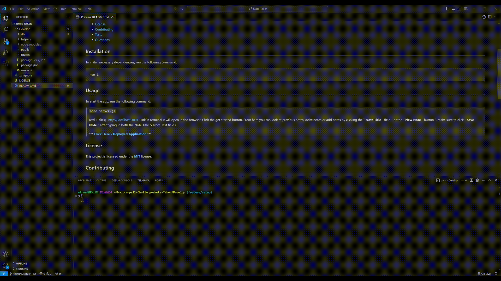

  # Note-Taker
  [](./LICENSE)

  ## Description
  This is my week 11-Challenge. This is a simple application where the user will be able to add and delete simple notes for keeping track of tasks. In this challenge I was givin starter code that and I needed to create api routes for the application. I had to make sure that all the routes were synced properly so the html would diplay correctly after adding and deleting notes from the array of notes. 

  ## Table of Contents 
  * [Installation](#installation)
  * [Usage](#usage)
  * [License](#license)
  * [Contributing](#contributing)
  * [Tests](#tests)
  * [Questions](#questions)

  ## Installation
  To install necessary dependencies, run the following command:
  ```
  npm i
  ```
  ## Usage
  To start the app, run the following command:
  
  >`node server.js`
  >
  >(ctrl + click) "http://localhost:3001" link in terminal it will open in the browser. Click the get started button. From here you can look at previous notes, delte notes or add notes by clicking the " **Note Title** - field " or the " **New Note** - button ". Make sure to click " **Save Note** " after typing in both the Note Title & Note Text fields.
  > 
  >*** **[Click Here - Deployed Application](https://note-taker-e6ca.onrender.com)** ***

  

  ## License
  This project is licensed under the **[MIT](./LICENSE)** license.

  ## Contributing
  N/A

  ## Tests
  To run tests, run the following command:
  ```    
  N/A
  ```
  ## Questions
  If you have any questions about the repo, open an issue or contact me directly at **rhinosstuff@gmail.com**.
  
  You can explore my other projects on GitHub **[rhinosstuff](https://github.com/rhinosstuff)**.
  
  